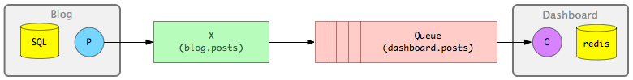

My exercise to understand how to perform pub/sub in Rails using RabbitMQ. Detailed tutorial is available [here](https://www.monterail.com/blog/2014/event-sourcing-on-rails-with-rabbitmq).

---

Let's imagine two applications: a typical Blog application with posts and a Dashboard application that displays 5 recently created posts. Instead of building an HTTP API in Blog so that Dashboard could ask for recent posts we will make Blog tell about each new post.

In the diagram above there is:

- Blog - a typical Rails app backed by SQL database
- P - RabbitMQ Producer
- X - RabbitMQ Exchange
- Queue - RabbitMQ Queue
- C - RabbitMQ Consumer
- Dashboard - Rails app backed by Redis

After a post is created in Blog application it will go to Producer which will then send a message to Exchange. Exchange will put the message into a Queue. Then the Consumer, connected to this Queue, will grab the message and update Dashboard's Redis-based cache.

---

- [Producer (blog) source code](https://github.com/zulhfreelancer/rails_rabbitmq_producer)
- [Consumer (dashboard) source code](https://github.com/zulhfreelancer/rails_rabbitmq_consumer)

---

FYI, [redis-commander](https://github.com/joeferner/redis-commander) is a good tool to easily view the Redis contents.
